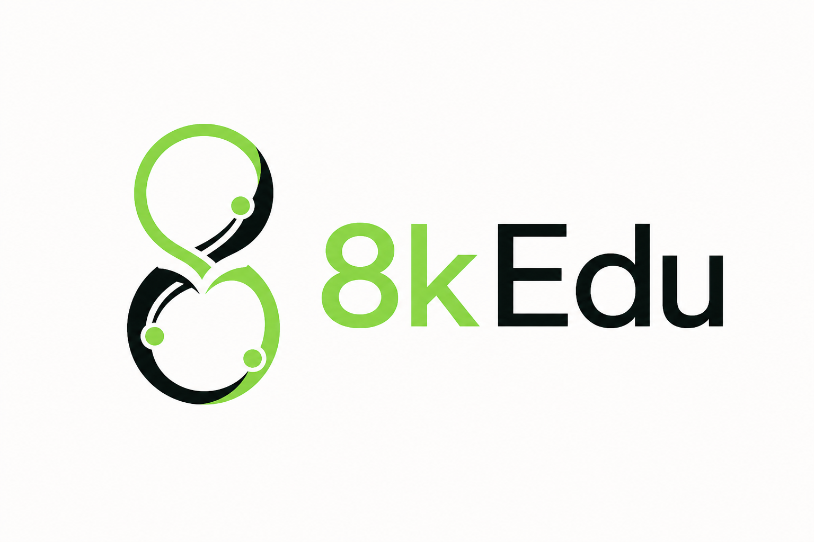
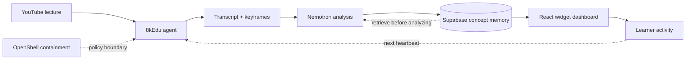

# 8kEdu — lectures you can touch



8kEdu turns a YouTube lecture into an interactive learning dashboard. It finds teachable moments, generates editable widgets, and learns from earlier lectures so later runs need less model work.

## Demo

| | |
|---|---|
| **Team** | Team 8kEdu |
| **Track** | Recursive Intelligence |
| **Loom video** | https://www.loom.com/share/cc3035fd7be945d3a884611ac7e5abff |
| **Live app** | https://dev.perspectivity.co/8kedu/ |
| **Repository** | https://github.com/8k-Edu/8kEdu |
| **App** | `/` lesson · `?view=graph` recursive memory · `?view=agent` agent activity |

## What it does

- Converts lecture transcripts and keyframes into interactive concepts.
- Synchronizes widgets, chapters, and transcript passages with the video.
- Renders matrices, attention, softmax, plots, and Python notebooks.
- Lets learners create, remix, share, and export interactive moments.
- Runs an autonomous heartbeat that discovers, processes, and sequences lessons.
- Reuses a persistent concept graph across teachers and videos.

## Recursive intelligence

Each analyzed lecture adds concepts, prerequisites, widget patterns, and validated examples to shared memory. The next run retrieves that knowledge before deciding which frames still need vision-model analysis.

The executed paired experiment seeds memory only with Karpathy, then processes the same 64 held-out VisualAI frames twice. Warm memory cuts actual Nemotron calls from 64 to 8 and elapsed time from 553.1 to 64.7 seconds.

The dashboard at `?view=graph` shows the learning curve, eight-video source library, 71-concept graph, cold/warm traces, recall, and retrieval precision. Self-attention now contains 23 grounded moments across four videos and teachers. See the [recursive experiment plan](docs/hackguide/RECURSIVE.md) for the protocol and evidence.

Reproduce the isolated pair with:

```bash
KEDU_MAX_TOKENS=1024 KEDU_CONCURRENCY=4 uv run python -m agent.paired \
  --backend vllm --max-px 512
```

Rebuild the post-experiment eight-video source library from the committed concept specs with:

```bash
uv run python scripts/expand_recursive_demo.py
```

## Project summary

YouTube contains exceptional teaching, but video is passive: learners can watch an instructor manipulate a model without touching it. Rebuilding those interactions by hand for every lecture does not scale.

8kEdu watches a lecture through its transcript and keyframes, identifies teachable moments, and turns them into live widgets beside the player. Learners can change parameters, run Python, remix an artifact, or export selected moments.

An autonomous agent discovers and processes lectures, while a curator grows a reusable library. Nemotron produces structured concept specs; a deterministic React widget kit renders them. Supabase stores shared artifacts and learner state.

The recursive layer connects equivalent concepts across teachers. Later runs reuse validated widgets and spend model calls only on uncertain frames, improving the content pipeline over time.

8kEdu is for students who learn by doing, teachers assembling interactive lessons, and creators who want one lecture to become a reusable learning experience.

## Architecture



`ingest.py` extracts transcripts, chapters, and keyframes. `analyze.py` converts them into structured concept specs. `app/` renders the video, timeline, widgets, agent activity, and recursive graph.

## Quick start

Requirements: Node 22.19+, Python 3.12, [`uv`](https://docs.astral.sh/uv/), and `ffmpeg`.

```bash
git clone https://github.com/8k-Edu/8kEdu.git
cd 8kEdu
uv sync
cd app && npm install && npm run dev
```

Open `http://localhost:5173`. The repository includes prepared demo data, so the lesson and recursive dashboard work without new model calls.

To start the API, live widget service, frontend, and autonomous loops together:

```bash
./run.sh --loop
```

Then open:

- `http://localhost:5173/` — interactive lesson
- `http://localhost:5173/?view=graph` — recursive learning dashboard
- `http://localhost:5173/?view=agent` — live agent activity

## Process a lecture

```bash
uv run ingest.py "https://www.youtube.com/watch?v=<id>"
uv run analyze.py --backend vllm --video <id>
uv run serve.py --backend vllm
```

Supported analysis backends include `mlx`, `lmstudio`, `vllm`, `openai`, `gemini`, and `openrouter`. Local inference is the default. In the lesson header, authenticated guest users can switch to credit-metered OpenRouter or enter their own key; BYOK keys remain only in the running API process and are never persisted.

### Serving Nemotron on Apple Silicon (vLLM)

One model — Nemotron-3-Nano-Omni — does vision (reads keyframes), reasoning, and the agent's decisions. We serve the 4-bit MLX build with [`vllm-mlx`](https://pypi.org/project/vllm-mlx/) (OpenAI-compatible), so both the analysis pipeline and the agent brain point at one endpoint on `:8000`.

```bash
uv tool install vllm-mlx
# One-time: fix mlx_vlm loading the 4bit audio tower (see note below)
uv run python scripts/patch-vllm-nemotron-audio.py
# Serve vision + reasoning on :8000
./scripts/serve-vllm.sh
```

> **Note — audio-tower patch.** mlx-community's 4-bit conversion stores the Omni audio (`sound_encoder`) conv weights in MLX layout, but `mlx_vlm`'s loader assumes PyTorch layout and re-transposes them, crashing at load (`Expected shape (256, 3, 3, 1) but received (256, 3, 1, 3)`). 8kEdu uses only the vision + text towers; `scripts/patch-vllm-nemotron-audio.py` makes that transpose a no-op so the model loads. It is idempotent — re-run it after `uv tool upgrade vllm-mlx`. LM Studio (`--backend lmstudio`, `:1234`) remains a drop-in fallback that serves the same model via GGUF.

## Configuration

Copy `.env.example` to `.env`. The main settings are:

```bash
SUPABASE_DB_URL="postgresql://..."
SUPABASE_URL="https://<project>.supabase.co"
SUPABASE_SECRET_KEY="sb_secret_..."
SUPABASE_PUBLISHABLE_KEY="sb_publishable_..."
APIFY_API_TOKEN="apify_api_..."

# Local inference — vLLM (Apple Silicon MLX), one endpoint for vision + brain
KEDU_BACKEND="vllm"
VLLM_BASE_URL="http://localhost:8000/v1"
VLLM_MODEL="mlx-community/Nemotron-3-Nano-Omni-30B-A3B-Reasoning-4bit"
NEMOTRON_BASE_URL="http://localhost:8000/v1"
NEMOTRON_MODEL="mlx-community/Nemotron-3-Nano-Omni-30B-A3B-Reasoning-4bit"
KEDU_TIMEOUT="240"

# LM Studio fallback (serves the same model over GGUF on :1234)
# KEDU_BACKEND="lmstudio"
# KEDU_BASE_URL="http://localhost:1234/v1"
# KEDU_MODEL="nvidia/nemotron-3-nano-omni"

AGENT_HANDLE="demo"
```

Apply the Supabase schema with `supabase db push` or run the SQL files in `supabase/migrations/`. Secrets stay in the gitignored root `.env`.

## Containment

The agent can run inside an OpenShell sandbox with allowlisted services and audit-logged egress. The policy and reproducible demos live in [`claw-agent/`](claw-agent/).

```bash
nemoclaw scoutclaw policy-add 8kedu --from-file claw-agent/policies/8kedu.yaml --yes
bash claw-agent/contain_demo.sh
bash claw-agent/contained_agent_demo.sh
```

## Data provenance

- Demo inputs are public YouTube lectures processed with `yt-dlp`.
- `data/<videoId>/` stores derived transcripts, keyframes, chapters, and concept specs—not source videos.
- Concept specs are generated from keyframes and transcript windows by the configured vision-language model.
- Community seed profiles and vote counts are synthetic; they contain no real user data.
- Curator results come from public videos discovered at runtime and are cached for reuse.

## Current scope and next

Experiment `p20260719a` is a fresh executed pair: identical model, prompt hash, 64-frame target, image settings, token budget, temperature, and concurrency. Only Karpathy memory differs between conditions.

Known-concept recall and retrieval precision are both 100%; overall cold-concept recall is 66.7%. Next, we plan to adapt retrieved specs to each teacher's visuals, connect mastery to sequencing, and expand multi-user identity.

## Team

| Name | Role | Contact |
|---|---|---|
| Andy Khan | Agent loop, analysis engine, frontend, containment | support@perspectivity.co |
| Nickolas Scipione | Performance, observability, database and infrastructure | github.com/nickscip |

## Repository layout

```text
ingest.py                 video, transcript, chapter, and frame extraction
analyze.py                concept analysis and recursive-memory updates
serve.py                  live widget API
agent/                    heartbeat, curator, API, and persistence
app/src/                  React dashboard and widget kit
claw-agent/               OpenShell policy and containment demos
data/<videoId>/           derived demo artifacts
docs/hackguide/           demo script and recursive experiment notes
supabase/migrations/      database schema
```
