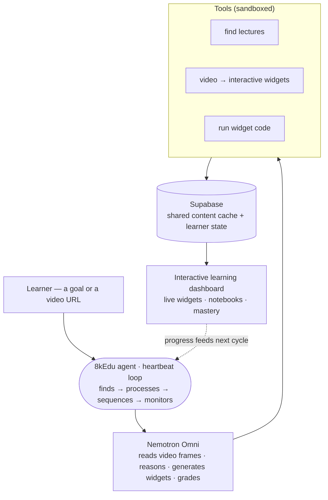

# 8kedu — lectures you can touch

Turn any YouTube lecture into an **interactive learning dashboard**. An AI pipeline reads the video's transcript + keyframes and turns every teachable moment into a **live, editable widget** beside the player — drag an attention matrix, run real Python in-browser, tweak a mortgage calculator with the speaker's own numbers. Works on any topic: AI/STEM, real estate, fintech.

> Brilliant.org, auto-generated from any lecture — on any topic.

Part of the **8kedu autonomous learning agent** (built for the AITX × NVIDIA Claw Agent Hackathon). This repo is the video→widget **engine + app**; the agent layer (heartbeat curriculum builder, NemoClaw/OpenShell containment, Nemotron omni brain, Supabase persistence) wraps it — see [`spec/spec.md`](spec/spec.md) and [`docs/hackguide/`](docs/hackguide/).

---

## What it does

- **Paste a lecture URL** → the pipeline extracts interactive concepts across the whole video.
- **Timeline of touchable moments** — colored ticks per concept, chapter pills, synced transcript.
- **Live widgets** — matrices, attention, softmax, function plots, and full **Python notebooks** running in-browser (numpy/matplotlib via pyodide).
- **Select any transcript passage → "make it interactive"** — the model reads that exact frame and mints a widget.
- **Point at the video** ("touch the screen") — drag a box over any drawing → it comes alive.
- **Remix** — any widget's state encodes into a URL + QR (no backend); **export** selected moments to Jupyter `.ipynb`, Markdown, or a printable deck.
- **Roles** — student / teacher / creator / researcher tailor the default view + export.

---

## Architecture



Under the hood, the pipeline: `ingest.py` (yt-dlp video + subs + chapters → ffmpeg keyframes) → `analyze.py` (each keyframe + transcript → vision-language model → concept-spec JSON) → `app/` (React player + timeline + widgets) with `serve.py` (FastAPI, live widget minting). Transcripts, frames, concept specs and inference results are cached in **Supabase** and shared across users — analyze a video once, everyone reuses it.

**The product is the concept-spec schema:** the model emits data (`{widget, title, params, time, frame}`), a deterministic widget kit renders it. No live codegen for the parametric widgets; the one sandboxed exception is the Python notebook widget (pyodide, in-browser).

> Full architecture + agent design: [`docs/architecture.pdf`](docs/architecture.pdf) (previewable) · [`docs/architecture.html`](docs/architecture.html) (with bounty/judging strategy)

Widget tiers: parametric kit (`matrix_mul`/`attention`/`softmax`/`function_plot`) → `composite` grammar → `notebook` (real numpy/matplotlib/scipy/sympy). Persistence/caching (transcripts, frames, concept specs, inference results — shared across users) is backed by **Supabase** in the agent build.

---

## Install

Prereqs: **Node ≥ 22.19**, **Python 3.12**, [`uv`](https://docs.astral.sh/uv/), `ffmpeg`. Local inference is optional (LM Studio or ollama with a vision + tools model); cloud backends are off by default.

```bash
git clone https://github.com/8k-Edu/8kEdu.git
cd 8kEdu
uv sync                 # python deps (yt-dlp, mlx-vlm, fastapi, pillow, …)
cd app && npm install   # frontend deps
```

---

## Run locally

The repo ships **pre-baked concept data** for 3 demo videos, so the app works with **zero model calls**:

```bash
# frontend only — browse the pre-baked demos
cd app && npm run dev            # → http://localhost:5173
```

To process a **new** video and/or use live "make it interactive":

```bash
# 1) ingest + analyze a video (local model, free)
uv run ingest.py "https://www.youtube.com/watch?v=<id>"
uv run analyze.py --backend mlx --video <id>     # or --backend lmstudio / gemini

# 2) start the ask backend (live widget minting)
uv run serve.py --backend mlx                    # :8756, vite proxies /api → here

# 3) frontend
cd app && npm run dev                            # http://localhost:5173
```

Backends (`--backend`): `mlx` (in-process, local) · `lmstudio` / `openai` (any OpenAI-compatible endpoint via `TACTILE_BASE_URL`/`TACTILE_MODEL`) · `gemini` (BYOK).

### The autonomous agent + live dashboard

```bash
# learner heartbeat — Nemotron decides FIND / PROCESS / SEQUENCE / MONITOR each tick
uv run python -m agent.loop --interval 60

# curator heartbeat — autonomously grows the shared library per genre (find → frame → cache)
uv run python -m agent.curator --interval 300

# dashboard API (light, no VLM) — powers ?view=agent
uv run python -m agent.api   # :8787, vite proxies /agent → here
```
Or just **`./run.sh --loop`** to start everything (serve + api + frontend + both heartbeats).
Then open **http://localhost:5173/?view=agent** (or `dev.localhost:5174` on the dev branch) — the live
heartbeat feed, the curriculum building itself, the cache moat, and the OpenShell containment status.
Containment is applied + proven separately: see [`claw-agent/`](claw-agent/).

> **Cost guard:** cloud backends (`gemini`/`openai`) are **blocked by default** — set `TACTILE_ALLOW_CLOUD=1` to deliberately spend. Local (`mlx`/`lmstudio`) is unrestricted. Secrets live in a gitignored `.env`.

Pyodide (for notebook widgets) is vendored under `data/pyodide-dist/` for offline use.

---

## Repo layout

```
ingest.py  analyze.py  serve.py     # python pipeline + ask API
app/src/    App.jsx widgets.jsx exporters.js main.jsx
data/<videoId>/                     # per-video: transcript, frames, chapters, concepts
spec/spec.md                        # build-from-scratch spec
docs/architecture.pdf|.html         # architecture diagram (previewable)
docs/hackguide/                     # PLAN · STRATEGY · HACKATHON (hackathon docs)
```
