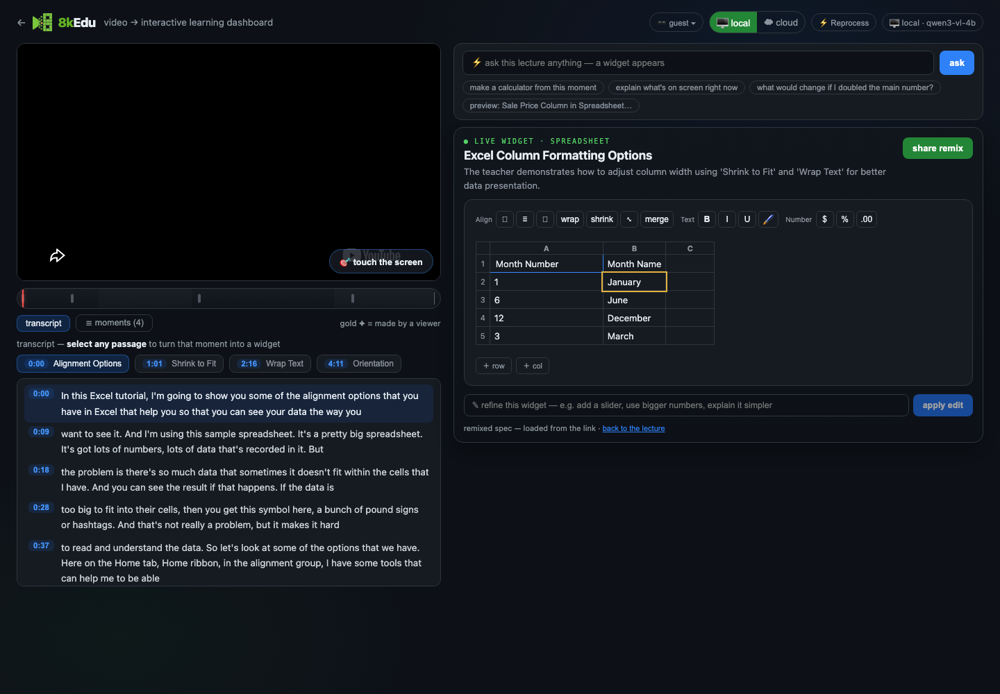
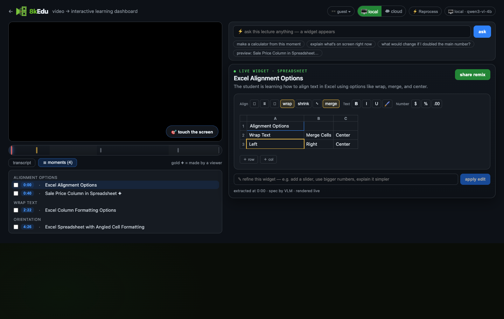
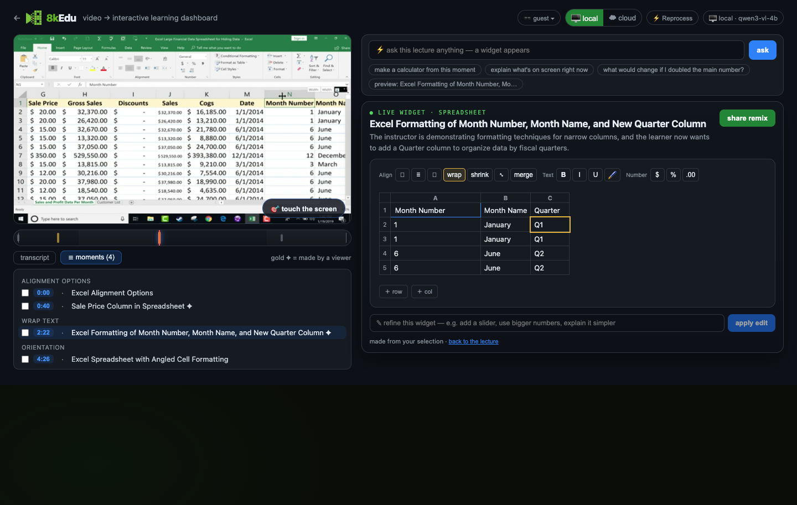
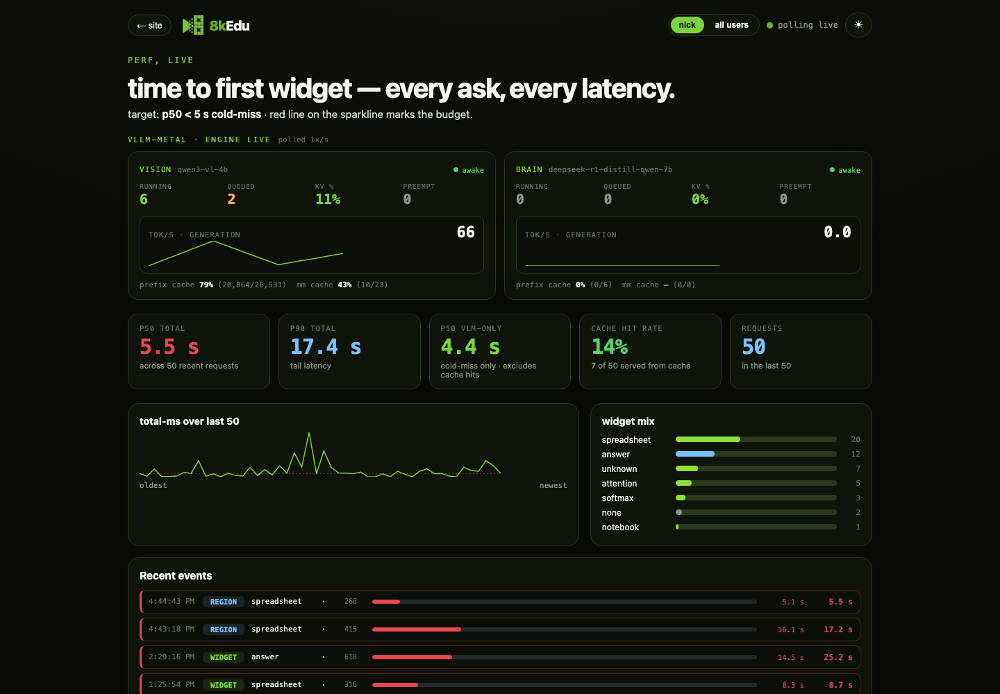
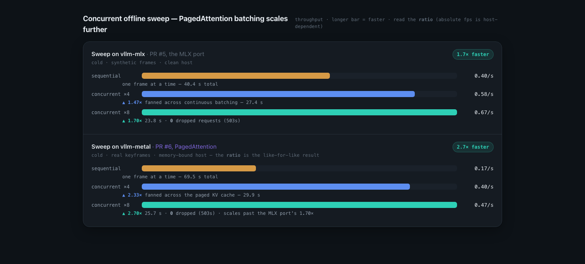
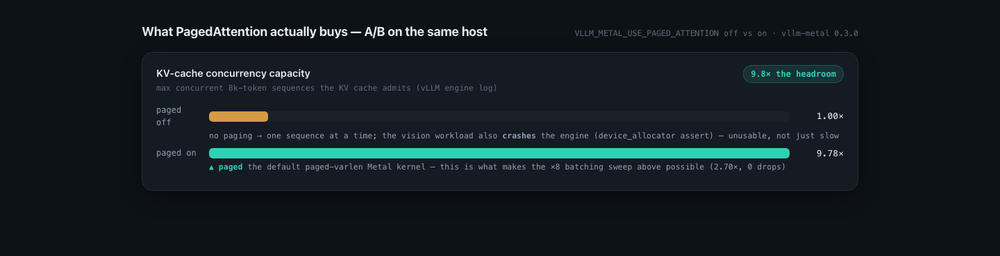

# 8kEdu × vLLM — Red Hat five-minute demo

This is the record-ready runbook for a five-minute screen share to a mixed technical Red Hat audience.

The thesis is simple: **a learner can turn one moment in a lecture into an interactive widget, refine it, and share it; vLLM makes that multimodal path practical as usage grows.**

The demo uses upstream vLLM through the `vllm-metal` plugin on Apple Silicon. It does not claim to run Red Hat AI Inference Server. The connection is the serving architecture: Red Hat AI Inference builds on vLLM and highlights the same PagedAttention and continuous-batching economics.

- [Red Hat AI Inference](https://www.redhat.com/en/products/ai/inference-server)
- [Red Hat explanation of PagedAttention and continuous batching](https://docs.redhat.com/en/documentation/red_hat_ai_inference_server/3.2/html/getting_started/about-getting-started_getting-started)

## Demo URLs

- Start here: <http://localhost:5173/>
- Excel lesson after upload: <http://localhost:5173/?v=5IgOP7Lpk5g>
- Live engine dashboard: <http://localhost:5173/?view=perf>
- Recorded throughput artifact: <http://localhost:8106/perf.html#throughput>
- PagedAttention A/B: <http://localhost:8106/perf.html#paged-attention>

Paste this public video URL into the landing page:

```text
https://www.youtube.com/watch?v=5IgOP7Lpk5g
```

The lesson is a 5:31 Excel alignment tutorial. The creation moment is **Excel Column Formatting Options** at `2:22`, where the instructor explains Wrap Text and Shrink to Fit.

## What must work

| Priority | Feature | Stage proof | Fallback |
| --- | --- | --- | --- |
| P0 | Video upload/open | Pasting the Excel URL opens the lesson without reprocessing it. | Open the direct lesson URL. |
| P0 | Ingest-once reuse | Transcript, chapters, four pipeline widgets, and the frame manifest load immediately. | Explain over the prepared lesson data. |
| P0 | Community reuse | The `0:40` spreadsheet is gold and marked `✦`, showing a viewer-shared widget merged into the lesson. | [`community-reuse.png`](assets/redhat-vllm-demo/community-reuse.png) |
| P0 | Screen-grab creation | At `2:22`, **touch the screen** accepts a dragged region and returns a spreadsheet. | Select the prepared `2:22` widget and continue. |
| P0 | Widget refinement | `Add a Quarter column.` returns a spreadsheet with the requested column. | [`refined-quarter-widget.png`](assets/redhat-vllm-demo/refined-quarter-widget.png) |
| P0 | Live observability | The performance view remains visible beside the product and shows both engines. | [`vllm-engine-live.png`](assets/redhat-vllm-demo/vllm-engine-live.png) |
| P0 | Throughput charts | Both focused `perf.html` views load from `:8106`. | [`vllm-throughput.png`](assets/redhat-vllm-demo/vllm-throughput.png) and [`paged-attention.png`](assets/redhat-vllm-demo/paged-attention.png) |
| P1 | OpenAI-compatible multimodal API | The region request sends a cropped frame plus nearby transcript to `/v1/chat/completions`. | Explain while a cached result is loading. |
| P1 | Structured output | vLLM returns a validated spreadsheet specification instead of UI code. | Use the four prepared spreadsheet specifications. |
| P1 | PagedAttention | The native kernel appears in the server log and the chart shows admitted KV-cache capacity. | Use the PagedAttention chart. |
| P1 | Continuous batching | The recorded concurrent sweep increases throughput with zero drops. | Use the throughput chart; do not claim one live request demonstrates batching. |
| P1 | Prefix and multimodal caching | The live dashboard reports cache counters after warmup and rehearsal. | Call cache activity optional if the counters are zero. |

Authentication, containment, agent heartbeat, cloud inference, export, and full-video reprocessing are outside this presentation. Do not open those paths during the five minutes.

## Day-before setup

### 1. Configure the demo profile

Set these non-secret values in the private `.env` file. Do not display that file while sharing the screen.

```dotenv
KEDU_BACKEND=vllm
VLLM_BASE_URL=http://localhost:8000/v1
VLLM_MODEL=qwen3-vl-4b
NEMOTRON_BASE_URL=http://localhost:8001/v1
NEMOTRON_MODEL=deepseek-r1-distill-qwen-7b
```

The two-engine Metal profile uses Qwen3-VL for video frames and DeepSeek-R1 for agent reasoning because the Metal plugin does not serve Nemotron Omni's MoE architecture. The live user flow in this talk exercises the Qwen3-VL vision engine; the second card shows the reasoning engine available to the wider agent workflow.

### 2. Verify the portable demo keyframe

The transcript, chapters, frame manifest, duration, four prepared widgets, one viewer-shared widget, and the required `2:22` keyframe are tracked. No external frame directory is needed for this five-minute demo.

If you want to exercise other moments, copy the remaining ignored development frames from the primary checkout:

```bash
export PRIMARY_CHECKOUT=/path/to/your/8kedu
rsync -a --ignore-existing \
  "$PRIMARY_CHECKOUT/data/5IgOP7Lpk5g/frames/" \
  data/5IgOP7Lpk5g/frames/
```

The presentation preflight verifies `data/5IgOP7Lpk5g/frames/f_000140.jpg` directly.

### 3. Start and warm vLLM

From terminal one:

```bash
./scripts/serve-vllm-metal.sh
```

Wait for both `warmed :8000` and `warmed :8001`. Confirm the vision log contains `Native paged-attention Metal kernels loaded`.

### 4. Start 8kEdu and the recorded charts

From terminal two:

```bash
./run.sh
```

From terminal three:

```bash
python3 -m http.server 8106 --directory docs
```

### 5. Run the presentation preflight

```bash
./scripts/preflight-redhat-demo.sh
```

Do not present until it ends with `RED HAT DEMO READY`.

### 6. Rehearse the product path once

1. Open the landing page and paste the Excel URL.
2. Confirm the lesson appears without the full-video processing panel.
3. Open **moments** and confirm the `0:40` entry has `✦`.
4. Select the `2:22` moment and pause the video.
5. Click **touch the screen** and drag around the visible spreadsheet grid.
6. Require a spreadsheet widget; interact with one cell.
7. Enter `Add a Quarter column.` in the refinement box.
8. Require a spreadsheet with a Quarter column.

After rehearsal, restore `data/5IgOP7Lpk5g/user_concepts.json` from Git so the next audience starts with only the prepared community contribution. Do not do this while services are writing the file.

```bash
git restore -- data/5IgOP7Lpk5g/user_concepts.json
```

### Verified product rehearsal — August 18, 2026

- Both vllm-metal engines started, warmed, and reported `awake`.
- Opening the pasted Excel URL reused the tracked transcript, chapters, concepts, and viewer-shared widget without re-ingestion.
- Selecting the spreadsheet region produced a valid spreadsheet in about 6.5 seconds.
- Refining it to add a Quarter column produced a valid replacement spreadsheet in about 5.1 seconds.
- The generated and refined widgets persisted through the same saved-widget API used by later viewers.
- The earlier concurrency-eight health rehearsal still completed two 12-frame runs with zero errors, zero 503 responses, and zero preemptions. That workload supports the charts; it is no longer run on stage.

### 7. Prepare the screen share

Use two browser windows on the shared display:

- Left, about 75% width: `http://localhost:5173/`, with the upload field visible.
- Right, about 25% width: `http://localhost:5173/?view=perf`, with the vision card visible and both engines reporting awake.

Also preload the two `:8106` chart URLs in the right-hand window. Copy the Excel YouTube URL to the clipboard. Disable notifications, hide bookmarks, close developer tools, and keep every terminal off the shared display.

Do not preload the direct lesson in the product window: the first visible action must be pasting the video as a user would.

## Five-minute run of show

### 0:00–0:20 — Upload the lecture

**On screen:** Landing page on the left; live performance view on the right.

Paste the Excel YouTube URL and click **learn →**.

**Say:**

> I start the same way a learner does: give 8kEdu a lecture I want to understand.

### 0:20–0:50 — Show ingest-once and community reuse

**On screen:** The lesson loads. Open **moments** and point to the gold `0:40` entry marked `✦`.

**Say:**

> This video has been ingested before, so we reuse its transcript, chapters, keyframes, and base widgets instead of processing five minutes of video again. Viewer-shared widgets come with it too—the gold moment was made by someone else and is now available to every learner who opens this lecture.

Click the **2:22** moment, then pause.

### 0:50–1:15 — Select the frame region

**On screen:** Excel at `2:22`.

Click **touch the screen** and drag a box around the spreadsheet grid, including the Month Number and Month Name columns.

**Say:**

> I want to work with this exact explanation, so I select what matters on the frame rather than writing a long prompt.

### 1:15–1:45 — Let vLLM create the widget

**On screen:** Creation spinner on the left; live vision metrics remain visible on the right.

**Say while it runs:**

> 8kEdu crops that region, pairs it with the nearby transcript, and sends both through an OpenAI-compatible multimodal request to Qwen3-VL on vLLM. The model returns schema-constrained JSON; deterministic React components render it. If this exact region was already requested, the shared application cache can return it without another model call.

Require a spreadsheet result. If it is still waiting at `1:40`, use the prepared `2:22` widget and continue.

### 1:45–2:15 — Use it, then refine it

**On screen:** Generated spreadsheet.

Edit one data cell—for example, change the first `1` to `2`. This makes the current spreadsheet a new refinement input even if the region itself came from the shared cache. In the refinement box enter:

```text
Add a Quarter column.
```

**Say:**

> The widget is live, not an image. Refinement sends the current structured specification back with a small edit request, so the model preserves the spreadsheet instead of starting over.

### 2:15–2:45 — Confirm the refined result

**On screen:** Replacement spreadsheet with the Quarter column; performance view still beside it.

**Say:**

> That is the complete product path: open an ingested lecture, inherit the community's work, select a new moment, generate a widget, and refine it. The request is also saved back to this video's timeline for the next learner.

At `2:45`, switch away from the product. **Do not return to the widget.**

### 2:45–3:10 — Read the live vLLM view

**On screen:** Expand the performance window.

**Say:**

> This is the serving layer behind what we just did. Qwen3-VL handled the frame and refinement; DeepSeek-R1 is the reasoning engine for the broader agent. We expose running and queued work, KV-cache use, preemptions, tokens per second, prefix-cache activity, and multimodal-cache activity instead of treating inference as a black box.

### 3:10–4:05 — Show the iterative throughput result

**On screen:** `perf.html#throughput` horizontal bars.

**Say:**

> Our first vLLM integration reached single-request parity with the previous server: about 1.33 seconds versus 1.40. The larger win appeared when we used the scheduler properly. On the vllm-mlx path, throughput rose from 0.40 to 0.67 frames per second at concurrency eight—a 1.70× gain with zero drops. With native vllm-metal and PagedAttention, the measured workload rose from 0.17 to 0.47 frames per second—a 2.70× gain with zero drops. The absolute rates came from different host conditions, so the honest comparison is each engine against its own sequential baseline.

### 4:05–4:35 — Explain PagedAttention

**On screen:** `perf.html#paged-attention`.

**Say:**

> PagedAttention stores each request's KV cache in reusable pages instead of reserving one large contiguous block. On the same host, enabling it increased admitted KV-cache concurrency for 8,000-token sequences from 1.00× to 9.78×. That is capacity headroom, not a 9.78× latency claim. It lets continuous batching keep useful work in flight as more learners arrive.

### 4:35–5:00 — Close on the charts

**On screen:** Keep the PagedAttention chart visible.

**Say:**

> The product and serving layers reinforce each other. Ingest-once and community reuse eliminate work; vLLM serves the new multimodal work efficiently with a compatible API, continuous batching, caching, and PagedAttention. That is how one lecture becomes a shared, interactive learning surface. Thank you.

## Metrics and attribution

| Recorded result | Safe claim |
| --- | --- |
| Cold widget `5.7 s → 1.9 s → 1.33 s` | The entire release progression is 4.3×. Downscaling and caching caused the first reduction; the final `1.9 → 1.33` step adopted vllm-mlx. |
| vllm-mlx `0.40 → 0.58 → 0.67 frames/s` | Continuous batching reached 1.47× at concurrency four and 1.70× at concurrency eight with zero drops. |
| vllm-metal `0.17 → 0.40 → 0.47 frames/s` | The native path reached 2.33× at concurrency four and 2.70× at concurrency eight with zero drops. |
| PagedAttention `1.00× → 9.78×` | This is admitted KV-cache concurrency capacity for 8,000-token sequences, not throughput or latency. |
| vLLM `1.33 s` versus LM Studio `1.40 s` | This establishes single-request parity. The headline is concurrent throughput. |
| Recursive run `64 → 8` calls | Application-level reuse eliminated calls; vLLM did not independently cause this reduction. |
| Warm cache `280×` and region re-ask `400×` | These are application-cache results, not vLLM results. |

The repository preserves the chart values, method notes, and commits, but not the original raw benchmark logs. Treat the charts as recorded results. A rehearsal request is a health check unless it recreates the original protocol and environment.

## Failure handling

- If the pasted video does not open within five seconds, use the direct lesson URL.
- If the community widget does not appear, do not troubleshoot on stage; say the tracked base artifacts were reused and continue to `2:22`.
- If YouTube playback fails, use the prepared widget capture and move directly to the live performance view.
- If region generation exceeds 25 seconds or returns prose, select the prepared `2:22` spreadsheet and demonstrate refinement there.
- If refinement exceeds 20 seconds, state the verified rehearsal result and switch to the charts.
- If the live dashboard is offline, use the static engine capture and speak in the past tense: “In the verified rehearsal…”
- If time reaches `3:00` while still in the product, switch immediately to the throughput chart and omit the live-dashboard explanation.

## Fallback captures

### Interactive Excel lesson



### Ingest-once lesson with a viewer-shared moment



### Refined Quarter-column widget



### Live vLLM engines



### Concurrent throughput



### PagedAttention capacity



## Final checklist

- [ ] Power connected; memory-heavy applications closed.
- [ ] Both engines warmed before opening the call.
- [ ] App is on `:5173`; chart server is on `:8106`.
- [ ] `./scripts/preflight-redhat-demo.sh` is green.
- [ ] Landing page is visible and the Excel URL is on the clipboard.
- [ ] The `0:40` viewer-shared moment is gold and marked `✦`.
- [ ] Region generation and Quarter-column refinement both passed once.
- [ ] `user_concepts.json` was restored to the prepared one-widget state after rehearsal.
- [ ] Performance window is awake beside the landing page.
- [ ] Both chart URLs are preloaded and focused correctly.
- [ ] Notifications are disabled and terminals are off-screen.
- [ ] Rehearsal reaches the charts by `2:45` and finishes by `4:45`.
