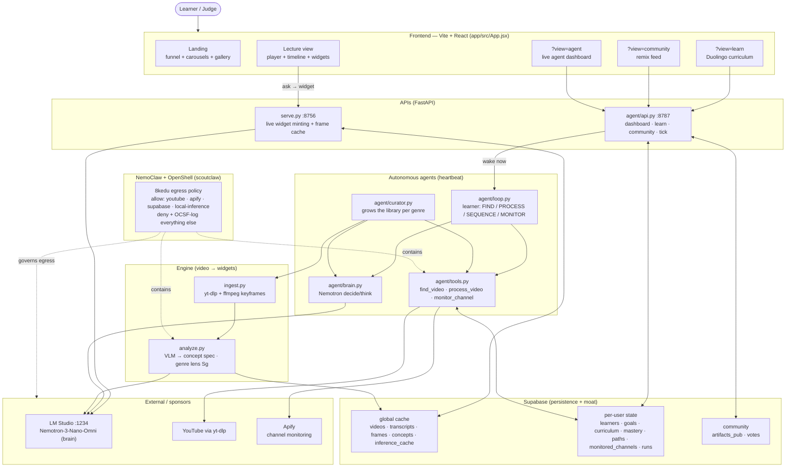
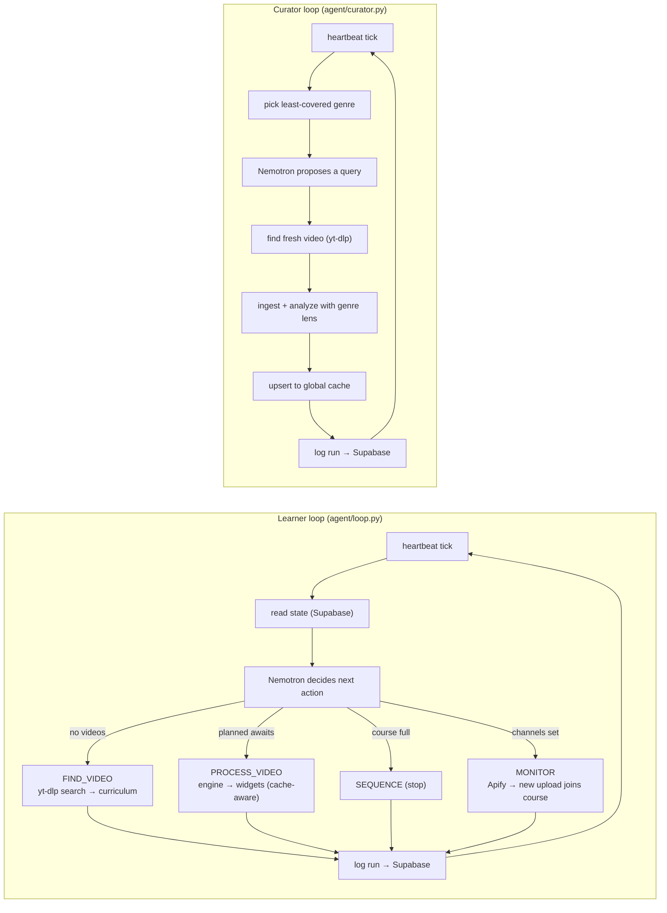
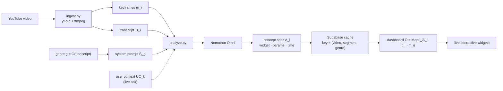
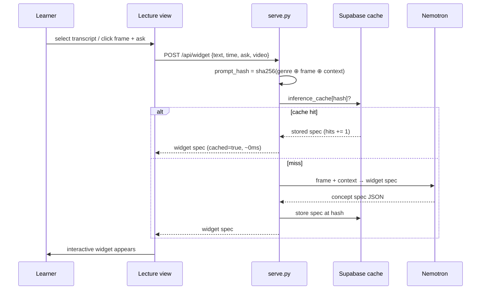

# 8kEdu — Architecture (component map)

How every component works and contributes. Four views: the whole system, the two autonomous
heartbeats, the video→widgets pipeline, and the live-ask + cache path.

---

## 1. Whole-app structure

**Reading it:** the frontend is thin — it renders what the agents produce. Two agents run on a
heartbeat (learner + curator), both reason through **Nemotron** and act through sandboxed **tools**.
The engine turns a video into interactive widgets. **Supabase** is both the agent's memory and the
shared cache (the moat). **OpenShell** wraps every tool + engine call — nothing reaches a host
outside the allowlist.

---

## 2. The two autonomous heartbeats

Both satisfy the Claw-Agent definition: **wake on a loop, not a prompt**; act unprompted; persist
context in Supabase. The learner grows one course; the curator grows the shared library for everyone.
Both are crash-proof — model unreachable → heuristic fallback, tool failure → logged error run.

---

## 3. The video → widgets pipeline (the funnel)

The artifact equation: **A_i = M̂(S_g, UC_k, m_i ⊕ f_i..f_n ⊕ Tr_i)**, cached on
`(video, segment, genre)` → computed once, reused by every learner → marginal cost per learner ≈ $0.

---

## 4. Live-ask + two-tier cache

Two tiers: **video-level** (`process_video` reuses all of a video's widgets) and **frame-level**
(`inference_cache` catches identical asks across users). The dashboard shows the live hit-rate and
$ saved.

---

*Companion:* [`SUBMISSION.md`](SUBMISSION.md) · [`STRATEGY.md`](STRATEGY.md) · [`PLAN.md`](PLAN.md) · [`../architecture.pdf`](../architecture.pdf) (print version).
